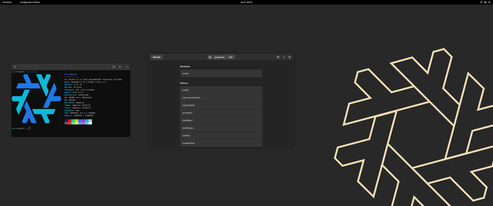

# The NixOS Installer

This installer is named after my doggo Onyxia.

At the core of this installer it does the following:

- Partition the drive of your choice
- Installs a base of NixOS (`configuration.nix`)
- Installs a DE/WM of your choice (currently supporting GNOME and Plasma)
- Installs needed packages (`programs.nix`)
- Installs needed packages for certain hardware 

nix files are from [this repo](https://gitlab.com/ahoneybun/nix-configs/) but that can be changed as needed.

Tested on the following drives:
- SATA 
- NVMe

Tested on x86_64 machines.

This sets the hashedPassword to my own so you will need to update it to match your own as well as the username. I created the hash with this command:

```
sudo mkpasswd -m sha-512
```

## Get Started

Prerequisites:

- Prepare an installation medium.
- Boot the live environment.
- Connect to internet.

## Connect to internet

https://nixos.org/manual/nixos/stable/index.html#sec-installation-booting-networking

## Start the installer

```
curl https://gitlab.com/ahoneybun/nyxi-installer/-/raw/main/install.sh > install.sh; sh install.sh
```

or

```
sh <(curl -L https://gitlab.com/ahoneybun/nyxi-installer/-/raw/main/install.sh)
```

The following will happen:

- Clear partition table for `/dev/***`.
- Creates a GPT partition table for `/dev/***`.
- Create a 1GB EFI partiton at `/dev/***1`.
- Create a encrypted LVM at `/dev/***2`.
- Create a swap partition in the LVM and sets it as the same size as the RAM for hibernation if requested.
- Create a root partition in the LVM.
- Install systemd-boot.

## Screenshots



## Roadmap

- [ ] 

# Possible Ideas

- [ ] 
